# Whisper

## A non-intrusive and fully customizable suite of popup messages for Android.

[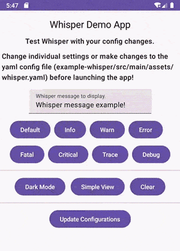](images/readme/intro_default.gif)

[Download Template](/whisper.yaml) | [Example App](/example-whisper) | [Config Examples](/configurations.md)

<br>

### Endless fun possibilities! 

<table>
<tr>
<td>

[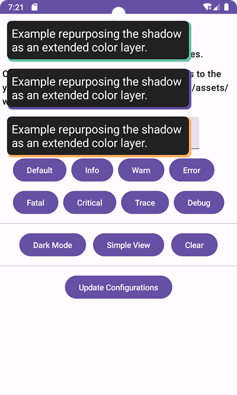](images/readme/intro_accent.png)

[Download Template](/yaml-samples/accent_theme/whisper.yaml)

</td>
<td>

[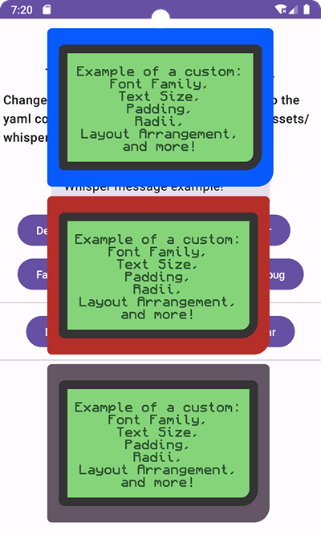](images/readme/intro_game.png)

[Download Template](/yaml-samples/game_theme/whisper.yaml)

</td>
<td>

[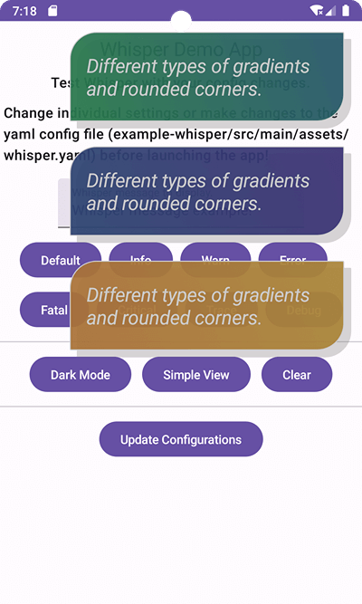](images/readme/intro_leaf.png)

[Download Template](/yaml-samples/leaf_theme/whisper.yaml)

</td>
</tr>
</table>

<br>

### The most subtle changes can make the biggest difference.

[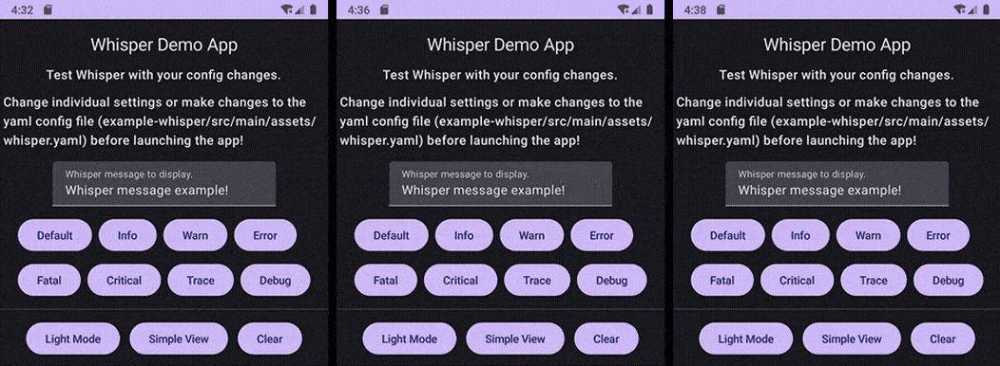](images/readme/intro_top_full.gif)

#### All `whisper.yaml` template samples can be found in [/yaml-samples/](/yaml-samples). 

<br>

## Transform Whisper and make it your own!
- Easy to use with simple and short one liners.
- Ready to use out of the box with no required setup. Just call `Whisper` with a [profile](#whisper-profiles) and it handles the rest!
- Tons of configurations including [custom sounds](/configurations.md#profilesoundtrigger), [vibration](/configurations.md#profilevibrate), [fonts](/configurations.md#profiledesigntextfontfontfamily), [shadow/layers](/configurations.md#profiledesignshadowcastshadow), [gradients](/configurations.md#profiledesignbackgroundtype--gradient_linear), and so many design options! See [configuration.md](/configurations.md) for all configurable fields with documentation, examples, and screenshots.
- Make config changes at runtime in code or import the [whisper.yaml template](/whisper.yaml) with your config changes (applies automatically. See the [collection of samples](/yaml-samples) for inspiration).
- Comprehensive documentation throughout the entire codebase, [configuration yaml](/whisper.yaml), [README](/README.md), and [configurations.md](/configurations.md).
- Non-modal to not interfere with user interaction, background processes, and foreground loading.
- Display as many or as little Whispers on screen at once.
- Dynamic durations based on message length [auto-dismiss](/configurations.md#timeoutlengthpercharacter) Whispers without having to consider what the best time out is for each Whisper (developer defined durations or none at all are also options).
- Whisper can double as a debugging tool! Use [Whisper.Trace](#trace) or [Whisper.Debug](#debug) for Whispers that only will display for debug builds (no need to comment out or delete these for release!).

### Check out the [example app for Whisper](/example-whisper) to test out Whisper and the many configuration options!

<br>

## Table of Contents
- [Usage / Examples](#usage--examples)
- [YAML Setup / Configuration](#yaml-setup--configuration)
- [Syntax / Setup](#syntax--setup)
- [Configuration Options](#configuration-options)
- [Other Functions and Considerations](#other-functions-and-considerations)
- [Installation](#installation)
- [Versioning](#versioning)
- [License](#license)

<br>

## Usage / Examples

### Ex 1: Creating the most simple Whisper possible

The following is the same as using [Whisper.default()](#default). This example does not contain a set [onClick action](#ex-3-creating-a-whisper-with-an-onclick-action) or [time out duration](#ex-2-creating-multiple-whispers-with-different-auto-dismissing-durations). The Whisper will auto-dismiss based on message length and [Whisper.GlobalConfig.timeoutLengthPerCharacter](/configurations.md#timeoutlengthpercharacter).
<br>In this example, `this` is the Activity.

<table>

<tr>
<td>

[](images/readme/example_1.gif)

</td>
<td>

```kotlin
Whisper(this, "I am a Whisper using the Default profile. I will auto-dismiss if not clicked.")
```

</td>
</tr>

</table>

<br>

### Ex 2: Creating multiple Whispers with different auto-dismissing durations

The following demonstrates displaying multiple Whispers at once, different forms of auto-dismissing, and how they are queued for auto-dismissing (skipping in order any that are not set for auto-dismissal).
<br>In the example, `this` is the Activity.
- The info Whisper has a set duration and will auto-dismiss once it is displayed on screen for that amount of time. 
- The warn Whisper has a duration of 0 meaning it will never auto-dismiss (but can be dismissed by tapping it or calling a [Whisper removal function](#removing-whispers) like [Whisper.remove()](#removing-a-specific-whisper-via-code) or [Whisper.clear()](#remove-all-whispers-at-once)). 
- The error Whisper does not have a defined duration meaning the duration before auto-dismissing will be based automatically  by the message length and [Whisper.GlobalConfig.timeoutLengthPerCharacter](/configurations.md#timeoutlengthpercharacter).

<table>

<tr>
<td>

[](images/readme/example_2.gif)

</td>
<td>

```kotlin
Whisper.info(this, "Auto-dismiss set for 2.5 seconds", 2500)
Whisper.warn(this, "Never auto-dismiss", 0)
Whisper.error(this, "Auto-dismiss time out driven by message length")
```

</td>
</tr>

</table>

<br>

### Ex 3: Creating a Whisper with an onClick action

The following demonstrates dismissing a Whisper by tapping it and performing an action when tapped (opening another Whisper in this case). Alternatives to closing a Whisper includes [letting it auto-dismiss](#ex-2-creating-multiple-whispers-with-different-auto-dismissing-durations), calling [Whisper.remove()](#removing-a-specific-whisper-via-code), or calling [Whisper.clear()](#remove-all-whispers-at-once). `Whisper.remove()` and `Whisper.clear()` are demonstrated in [Example 4](#ex-4-dismiss-using-whisperremove-and-whisperclear).
<br>NOTE: A defined onClick is not required for dismissing a Whisper by tapping it. Leaving the `onClick` parameter undefined or null will still allow a user to tap a Whisper to dismiss it (as long as [Whisper.GlobalConfig.tapToDismiss](/configurations.md#taptodismiss) is true).

<table>

<tr>
<td>

[](images/readme/example_3.gif)

</td>
<td>

```kotlin
Whisper.critical(
    activity = this, 
    message = "Tap to dismiss and perform an additional action",
    duration = 0
) { activity, whisperId ->
    Whisper.info(activity, "You closed the previous Whisper!")
}
```

</td>
</tr>

</table>

<br>

### Ex 4: Dismiss using Whisper.remove() and Whisper.clear()

The following demonstrates the use of [Whisper.remove()](#removing-a-specific-whisper-via-code) and [Whisper.clear()](#remove-all-whispers-at-once). Whispers can also be dismissed by [letting them auto-dismiss](#ex-2-creating-multiple-whispers-with-different-auto-dismissing-durations) or by tapping (as long as [Whisper.GlobalConfig.tapToDismiss](/configurations.md#taptodismiss) is true). See [Example 2](#ex-2-creating-multiple-whispers-with-different-auto-dismissing-durations) and [Example 3](#ex-3-creating-a-whisper-with-an-onclick-action) for demonstrations of Whispers closing in other ways.

<table>

<tr>
<td>

[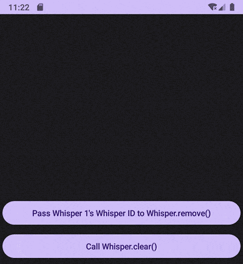](images/readme/example_4.gif)

</td>
<td>

```kotlin
val whisperId = Whisper.trace(
    activity = this,
    message = "Whisper 1: Use my returned Whisper ID when calling Whisper.remove()",
    duration = 0
)

Whisper.fatal(
    activity = this,
    message = "Whisper 2: Dismiss me with Whisper.clear()",
    duration = 0
)

Whisper.fatal(
    activity = this,
    message = "Whisper 3: Dismiss me with Whisper.clear()",
    duration = 0
)

// ...

// Button onClick action for "Pass Whisper 1's Whisper ID to Whisper.remove()":
Whisper.remove(this, whisperId)

// Button onClick action for "Call Whisper.clear()":
Whisper.clear(this)
```

</td>
</tr>

</table>

<br>

## YAML Setup / Configuration

Sample [whisper.yaml](/whisper.yaml)'s can be copied or downloaded from [/yaml-samples/](/yaml-samples).

While not required to use Whisper, it is highly recommended to add a [whisper.yaml](/whisper.yaml) configuration file with your desired changes to your project. The YAML configuration file is an optional file that automatically sets Whisper configurations (Whisper searches for the file and applies it during the first Whisper call. Default values are used if [whisper.yaml](/whisper.yaml) is not found).

### Importing the YAML configuration file

1. Any `whisper.yaml` from [/yaml-samples/](/yaml-samples) can be used. Or if preferred, the [default whisper.yaml file can be downloaded/copied here](/whisper.yaml).
2. Add [whisper.yaml](/whisper.yaml) to your module's assets resource folder (See screenshot below)
<br><b>Example: YourProject\app\src\main\assets\whisper.yaml</b>
3. YAML file name must be [whisper.yaml](/whisper.yaml). However, this can be changed to a different file name and extension by updating `Whisper.GlobalConfig.yamlFileName`. This change MUST be made before any other calls are made to Whisper. Because of the confusion this may cause, it is not recommended to change the [whisper.yaml](/whisper.yaml) file name.
4. Update the YAML with your desired changes. Any option you do not wish to change from the default value can be left untouched or removed from the YAML file.
5. Done! The first Whisper created in the lifecycle of your app will apply the [whisper.yaml](/whisper.yaml) settings. The first time a Whisper is opened, the YAML is applied. If a yaml file is not found or present, all configuration options are set to their default values. 
<br><b>For all YAML configurable fields, examples, and documentation, please see [configuration.md](/configurations.md).</b>

[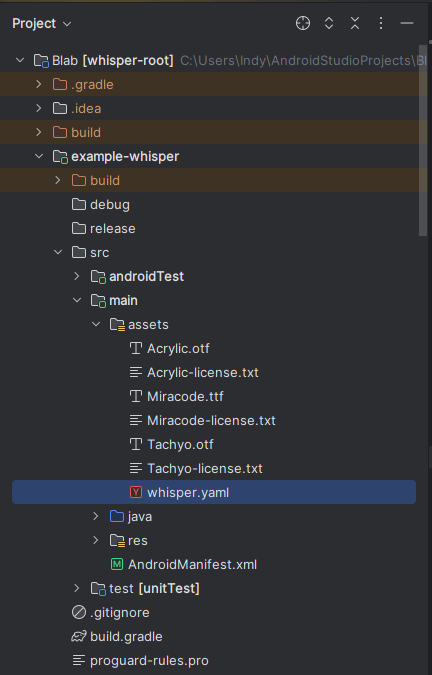](images/readme/yaml_location.png)

### Additional YAML config functions (these should almost never be used)

The following YAML functions are unnecessary to call for most use cases. These functions will either apply [whisper.yaml](/whisper.yaml) if it has not been applied yet or force it to apply again. However, [whisper.yaml](/whisper.yaml) automatically applies when calling Whisper for the first time in your app's lifecycle (thus meaning these functions should not be used in standard use cases).

- #### Whisper.GlobalConfig.applyYamlIfNeverRan()
  - If a [whisper.yaml](/whisper.yaml) config is present in your project, this function applies it to your Whisper settings only if [whisper.yaml](/whisper.yaml) has not already been applied prior in the lifecycle of the app. [whisper.yaml](/whisper.yaml) automatically applies to your settings when creating a Whisper for the first time in your app's lifecycle. The only time this function may need to be called is if there was dynamic code value changes made to [Whisper.GlobalConfig](/configurations.md) or the [profiles](/configurations.md) prior to creating your first whisper. This so [whisper.yaml](/whisper.yaml) does not overwrite those programmatic changes.
<br>Note: It is not recommended to ever make [Whisper.GlobalConfig](/configurations.md) or [profile](/configurations.md) changes programmatically. Recommended is to only use [whisper.yaml](/whisper.yaml) for configuration changes.

- #### Whisper.GlobalConfig.applyYaml()
  - If a [whisper.yaml](/whisper.yaml) config is present in your project, this function will overwrite any config changes made. This includes if prior changes were made programmatically to [Whisper.GlobalConfig](/configurations.md), the [profiles](/configurations.md), or if [whisper.yaml](/whisper.yaml) was already applied prior in the life of your app. [whisper.yaml](/whisper.yaml) automatically applies to your settings when creating a Whisper for the first time in your app's lifecycle. The only time this function may be needed is if dynamic code value changes were made to [Whisper.GlobalConfig](/configurations.md) or the [profiles](/configurations.md) that now need to be reverted. This so [whisper.yaml](/whisper.yaml) overwrites all those programmatic changes no longer needed.
<br>Note: It is not recommended to ever make [Whisper.GlobalConfig](/configurations.md) or [profile](/configurations.md) changes programmatically. Recommended is to only use [whisper.yaml](/whisper.yaml) for configuration changes.

<br>

## Syntax / Setup

### Main Whisper Syntax
Main usage and examples of Whisper can be found in [Usage / Examples](#usage--examples).

All Whisper [profiles](/configurations.md) have 4 function parameters to open a Whisper. Two are mandatory and two are optional:

- <b>`activity`</b> - Activity / <i><b>Required</b></i>
  - Active Activity. Needed for displaying the Whisper and determining if the app is running in debug.
- <b>`message`</b> - String / <i><b>Required</b></i>
  - Message text to display within the Whisper.
- <b>`duration`</b> - Long / <i><b>Optional</b></i>
  - How long the Whisper displays for before being auto-dismissed. 
  - `duration` cannot be less than [Whisper.GlobalConfig.durationDisplayMinimum](/configurations.md#durationdisplayminimum). If it is, this value is used instead. `duration` can be greater than [Whisper.GlobalConfig.durationDisplayMaximum](/configurations.md#durationdisplaymaximum), however. 
  - If this `duration` parameter is undefined, an auto-dismissing time out will still be used. The time out will be defined by the combination of the `message` length and [Whisper.GlobalConfig.timeoutLengthPerCharacter](/configurations.md#timeoutlengthpercharacter).
  - To have the Whisper never auto-dismiss, pass 0 as the `duration`.
- <b>`onClick`</b> - (Activity, String) -> Unit / <i><b>Optional</b></i>
  - Will execute the passed block of code when tapped. 
  - Will also close the individual Whisper when tapped regardless if `onClick` is defined (as long as [Whisper.GlobalConfig.tapToDismiss](/configurations.md#taptodismiss) remains true).
  - Available within `onClick` will be the Activity and its unique Whisper ID.
  - NOTE: If a Whisper does not have a time out (`duration` passed was 0) and [Whisper.GlobalConfig.tapToDismiss](/configurations.md#taptodismiss) is set to false, the Whisper can still be dismissed in the `onClick` by passing the unique Whisper ID to [Whisper.remove()](#removing-a-specific-whisper-via-code) or calling [Whisper.clear()](#remove-all-whispers-at-once). 

<br>

### Clean up!
Activities that may use Whisper should add `Whsiper.finish()` to their onDestroy. Without it, the following error may display in the logs: `android.view.WindowLeaked`
```kotlin
override fun onDestroy() {
    super.onDestroy()
    Whisper.finish(this)
}
```

<br>

### Whisper Profiles

Calling Whisper with a profile is the main use of Whisper. There are 8 profile options to allow for different colors and styles for better customizing Whisper. Two profiles, trace and debug, are reserved as debugging Whispers that do not show in release builds of the app.

#### Default

Creates a new Whisper using the Default profile. Can be called with `Whisper()`, `Whisper.invoke()`, or `Whisper.default()`.


<table>

<tr>
<td>

```kotlin
Whisper(activity, "Default Whisper profile")
// or
Whisper.invoke(activity, "Default Whisper profile")
// or
Whisper.default(activity, "Default Whisper profile")
```

</td>
<td>

[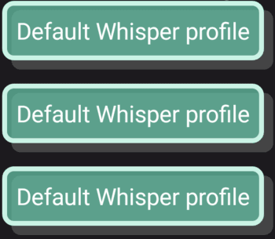](images/readme/whisper_default_profile.png)

</td>
</tr>

</table>

#### Info

Creates a new Whisper using the Info profile.

<table>

<tr>
<td>

```kotlin
Whisper.info(activity, "Info Whisper profile")
```

</td>
<td>

[](images/readme/whisper_info_profile.png)

</td>
</tr>

</table>

#### Warn

Creates a new Whisper using the Warn profile.

<table>

<tr>
<td>

```kotlin
Whisper.warn(activity, "Warn Whisper profile")
```

</td>
<td>

[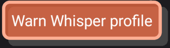](images/readme/whisper_warn_profile.png)

</td>
</tr>

</table>


#### Error

Creates a new Whisper using the Error profile.

<table>

<tr>
<td>

```kotlin
Whisper.error(activity, "Error Whisper profile")
```

</td>
<td>

[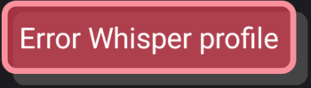](images/readme/whisper_error_profile.png)

</td>
</tr>

</table>

#### Fatal

Creates a new Whisper using the Fatal profile.

<table>

<tr>
<td>

```kotlin
Whisper.fatal(activity, "Fatal Whisper profile")
```

</td>
<td>

[](images/readme/whisper_fatal_profile.png)

</td>
</tr>

</table>

#### Critical

Creates a new Whisper using the Critical profile.

<table>

<tr>
<td>

```kotlin
Whisper.critical(activity, "Critical Whisper profile")
```

</td>
<td>

[](images/readme/whisper_critical_profile.png)

</td>
</tr>

</table>

#### Trace

Creates a new Whisper using the Trace profile. `Whisper.debug()` and `Whisper.trace()` will only be created if the app running in a debug build.

<table>

<tr>
<td>

```kotlin
Whisper.trace(activity, "Trace Whisper profile")
```

</td>
<td>

[](images/readme/whisper_trace_profile.png)

</td>
</tr>

</table>

#### Debug

Creates a new Whisper using the Debug profile. `Whisper.debug()` and `Whisper.trace()` will only be created if the app running in a debug build.

<table>

<tr>
<td>

```kotlin
Whisper.debug(activity, "Debug Whisper profile")
```

</td>
<td>

[](images/readme/whisper_debug_profile.png)

</td>
</tr>

</table>

<br>

## Configuration Options

### How to Configure
There are two ways to update from the default configurations:
1. Updating and importing the [whisper.yaml](/whisper.yaml) into your project (recommended)
2. Programmatically in code (not recommended in most cases)

Please see the [configuration.md](/configurations.md) documentation for more information, examples, and screenshots of each configuration option.

### Configuration options and examples

See the [configuration markdown](/configurations.md) for an example of each configuration option.
Each config options (both GlobalConfig and Profile Specific) can be navigated to directly with the links below
- [pixelDensityUnit](/configurations.md#pixelDensityUnit)
- [positionOnScreen](/configurations.md#positiononscreen)
- [sortOrder](/configurations.md#sortorder)
- [maxVisible](/configurations.md#maxvisible)
- [displaySpace](/configurations.md#displayspace)
- [timeoutLengthPerCharacter](/configurations.md#timeoutlengthpercharacter)
- [durationDisplayMinimum](/configurations.md#durationdisplayminimum)
- [durationDisplayMaximum](/configurations.md#durationdisplaymaximum)
- [animationTransitionDuration](/configurations.md#animationtransitionduration)
- [timeoutOnlyForOldestWhisper](/configurations.md#timeoutonlyforoldestwhisper)
- [tapToDismiss](/configurations.md#taptodismiss)
- Offset
  - [x](/configurations.md#offsetx)
  - [y](/configurations.md#offsety)
  - [additionalOffsetForStatusBar](/configurations.md#offsetadditionaloffsetforstatusbar)
- Profile
  - Sound
    - [trigger](/configurations.md#profilesoundtrigger)
    - [customSound](/configurations.md#profilesoundcustomsound)
  - [Vibrate](/configurations.md#profilevibrate)
  - Design
    - [Padding](/configurations.md#profiledesignpadding)
    - Text
      - [color](/configurations.md#profiledesigntextcolor)
      - [size](/configurations.md#profiledesigntextsize)
      - [gravity](/configurations.md#profiledesigntextgravity)
      - Font
        - [bold](/configurations.md#profiledesigntextfontbold)
        - [italic](/configurations.md#profiledesigntextfontitalic)
        - [underline](/configurations.md#profiledesigntextfontunderline)
        - [fontFamily](/configurations.md#profiledesigntextfontfontfamily)
    - Background
      - [Solid](/configurations.md#profiledesignbackgroundtype--solid)
      - [Gradient Linear](/configurations.md#profiledesignbackgroundtype--gradient_linear)
      - [Gradient Radial](/configurations.md#profiledesignbackgroundtype--gradient_radial)
      - [Gradient Sweep](/configurations.md#profiledesignbackgroundtype--gradient_sweep)
    - Border
      - [CornerRadius](/configurations.md#profiledesignbordercornerradius)
      - [size](/configurations.md#profiledesignbordersize)
      - [color](/configurations.md#profiledesignbordercolor)
    - Shadow
      - [castShadow](/configurations.md#profiledesignshadowcastshadow)
      - [color](/configurations.md#profiledesignshadowcolor)
      - [CornerRadius](/configurations.md#profiledesignshadowcornerradius)
      - [Inset](/configurations.md#profiledesignshadowinset)
      - [Padding](/configurations.md#profiledesignshadowpadding)

<br>

## Other Functions and Considerations

### Removing Whispers
Whispers can be dismissed in multiple ways. This includes an auto-dismiss time out, a set-dismiss time out, clicking the Whisper (so long as [Whisper.GlobalConfig.tapToDismiss](/configurations.md#taptodismiss) is true), or using [Whisper.remove()](#removing-a-specific-whisper-via-code) or [Whisper.clear()](#remove-all-whispers-at-once).

- #### Removing a specific Whisper via code
  - Anytime a Whisper is created, a unique `whisperId` (UUID) will be returned. This can be ignored if there is no intention of calling `Whisper.remove()` for that specific Whisper. Otherwise, this `whisperId` can be stored and used anytime to dismiss the active Whisper (nothing will happen if the Whisper is already dismissed). For a demonstration, see [example 4](#ex-4-dismiss-using-whisperremove-and-whisperclear).
    ```kotlin
    Whisper.remove(activity, whisperId)
    ```

- #### Remove all Whispers at once
  - All active Whispers (visibly being displayed and invisible Whispers queued) can all be removed by calling `Whisper.clear()`
    ```kotlin
    Whisper.clear(activity)
    ```

### Get Whisper Count
To get a real-time count of all active Whispers (visibly being displayed and invisible Whispers queued), use the following:
```kotlin
Whisper.activeWhisperCount()
```

### Vibration
A custom vibration can be applied per Whisper profile. More information and configuration details can be found in [configurations.md](/configurations.md#profilevibrate).
<br>If using Vibrate, make sure your module's `AndroidManifest.xml` includes the following, otherwise vibration will not work:
```xml
<uses-permission android:name="android.permission.VIBRATE"/>
```

### Sound
The device's [notification](/configurations.md#profilesoundtrigger) or a [custom sound file](/configurations.md#profilesoundcustomsound) can be played per Whisper profile.
If using a custom sound file, the file must be in module's `res/raw` directory. The set value must be the sound file name without the extension.
<br><b><u>Example:</u> src/main/res/raw/horn.mp3 -> "horn"</b>

[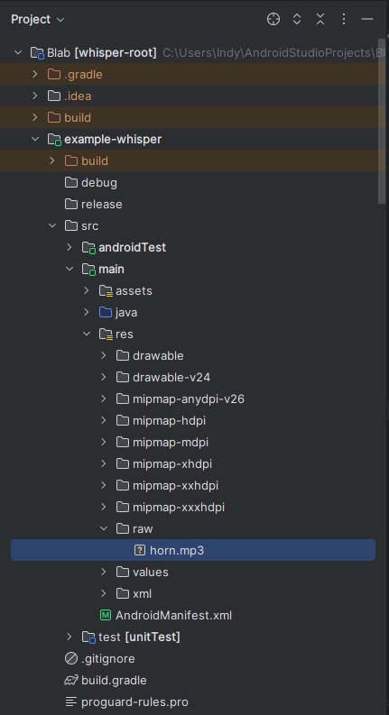](images/readme/sound_location.png)

### Apply Custom Fonts
Custom fonts can be applied per profile by setting the font file name to [Whisper.PROFILE.design.text.font.fontFamily](/configurations.md#profiledesigntextfontfontfamily).
Custom fonts need to be in the module's `/assets/` directory. Fonts should be either `.ttf` or `.otf`. The set value should be the font name with the extension (with the same casing as the file name).
<br><b><u>Example:</u> src/main/assets/Miracode.ttf -> "Miracode.ttf"</b>

[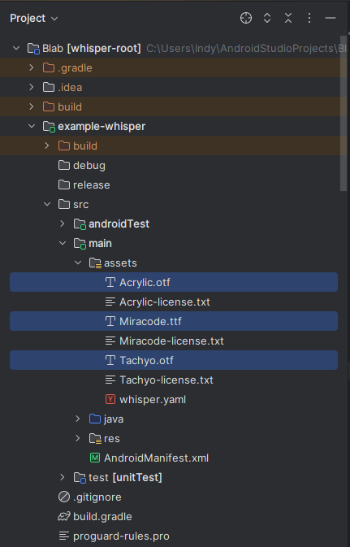](images/readme/font_family_location.png)

### Using Whisper with coroutines
Whispers do not need to be placed in coroutines. However, if Whispers need to be placed in a coroutine, using `Dispatchers.Main` is recommended to ensure proper behavior.
This may look like the following:
```kotlin
CoroutineScope(Dispatchers.Main).launch {
  // Whispers here
}
```

<br>

## Installation

### Install with JitPack
[](https://jitpack.io/#Digidemic/whisper)
1) Add JitPack to your project's root `build.gradle` at the end of `repositories`:
- ```groovy
  dependencyResolutionManagement {
      repositoriesMode.set(RepositoriesMode.FAIL_ON_PROJECT_REPOS)
      repositories {
          mavenCentral()
          maven { url 'https://jitpack.io' }
    }
  }
  ```
2) In the `build.gradle` of the module(s) you wish to use Whisper with, add the following to `dependencies`:
- ```groovy
  dependencies {
      // Required: Installs the .aar without any documentation.
      implementation 'com.github.digidemic:whisper:1.0.0'
      
      // Optional: Displays documentation while writing coding. 
      implementation 'com.github.digidemic:whisper:1.0.0:javadoc'
  
      // Optional: Displays documentation (more comprehensive than javadoc in some cases) and uncompiled code when stepping into library.
      implementation 'com.github.digidemic:whisper:1.0.0:sources'
  }
  ```
3) [Sync gradle](https://www.delasign.com/blog/how-to-sync-an-android-project-with-its-gradle-files-in-android-studio/) successfully.
4) Done! Your Android project is now ready to use Whisper. Go to [Examples](#usage--examples) or [Syntax](#syntax--setup) for Whisper usage!

<br>

## Versioning
- [SemVer](http://semver.org/) is used for versioning.
- Given a version number MAJOR . MINOR . PATCH
    1) MAJOR version - Incompatible API changes.
    2) MINOR version - Functionality added in a backwards-compatible manner.
    3) PATCH version - Backwards-compatible bug fixes.
       <br><br>

## License
Whisper created by Adam Steinberg of DIGIDEMIC, LLC
```
Copyright 2024 DIGIDEMIC, LLC

Licensed under the Apache License, Version 2.0 (the "License");
you may not use this file except in compliance with the License.
You may obtain a copy of the License at

    http://www.apache.org/licenses/LICENSE-2.0

Unless required by applicable law or agreed to in writing, software
distributed under the License is distributed on an "AS IS" BASIS,
WITHOUT WARRANTIES OR CONDITIONS OF ANY KIND, either express or implied.
See the License for the specific language governing permissions and
limitations under the License.
```

---

The Whisper Example App uses fonts: `Acrylic.otf`, `Miracode.ttf`, and `Tachyo.otf`. All are under SIL OPEN FONT LICENSE Version 1.1. A copy of each license can be found in in [example app's assets directory](/example-whisper/src/main/assets).

Whisper consumes another DIGIDEMIC library, [Kyaml](https://github.com/Digidemic/kyaml), to read and apply the [whisper.yaml](/whisper.yaml) config file.