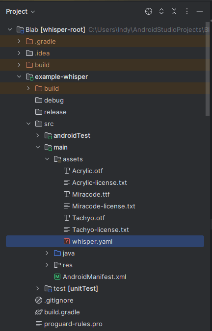
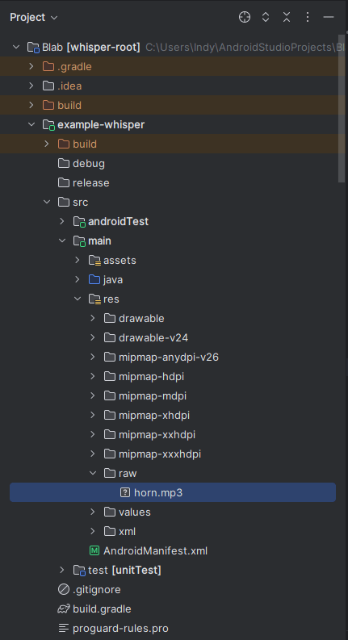
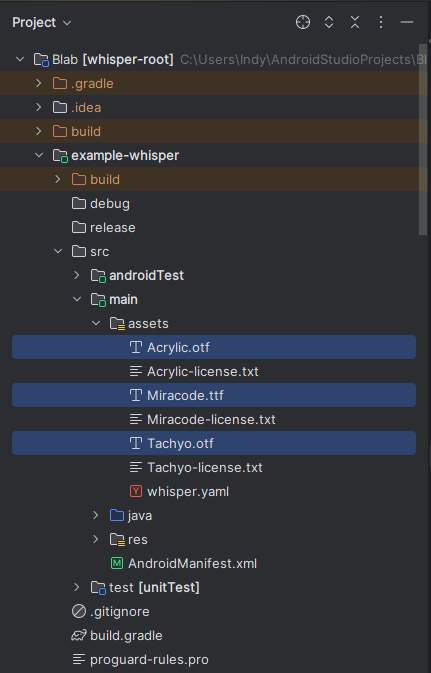
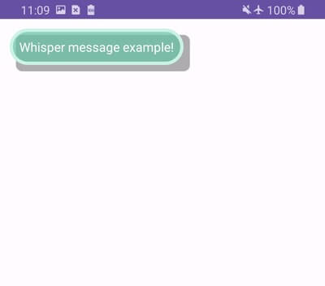

# Whisper Config Options (GlobalConfig and Profile)

### There are two ways to update from the default configurations:
1. Programmatically in code (not recommended in most cases).
2. [Updating and importing](/README.md#yaml-setup--configuration) the [whisper.yaml](/whisper.yaml) into your project (recommended).
   - See [YAML Setup / Configuration](/README.md#yaml-setup--configuration) in the main [README](/README.md) for YAML documentation and importing [whisper.yaml](/whisper.yaml).
   - A collection of [whisper.yaml](/whisper.yaml) template samples can be found in [/yaml-samples/](/yaml-samples). 
   - [](images/readme/yaml_location.png)

<br>

## Table of Contents
- [pixelDensityUnit](#pixeldensityunit)
- [positionOnScreen](#positiononscreen)
- [sortOrder](#sortorder)
- [maxVisible](#maxvisible)
- [displaySpace](#displayspace)
- [timeoutLengthPerCharacter](#timeoutlengthpercharacter)
- [durationDisplayMinimum](#durationdisplayminimum)
- [durationDisplayMaximum](#durationdisplaymaximum)
- [animationTransitionDuration](#animationtransitionduration)
- [timeoutOnlyForOldestWhisper](#timeoutonlyforoldestwhisper)
- [tapToDismiss](#taptodismiss)
- Offset
  - [x](#offsetx)
  - [y](#offsety)
  - [additionalOffsetForStatusBar](#offsetadditionaloffsetforstatusbar)
- Profile
  - Sound
    - [trigger](#profilesoundtrigger)
    - [customSound](#profilesoundcustomsound)
  - [Vibrate](#profilevibrate)
  - Design
    - [Padding](#profiledesignpadding)
    - Text
      - [color](#profiledesigntextcolor)
      - [size](#profiledesigntextsize)
      - [gravity](#profiledesigntextgravity)
      - Font
        - [bold](#profiledesigntextfontbold)
        - [italic](#profiledesigntextfontitalic)
        - [underline](#profiledesigntextfontunderline)
        - [fontFamily](#profiledesigntextfontfontfamily)
    - Background
      - [Solid](#profiledesignbackgroundtype--solid)
      - [Gradient Linear](#profiledesignbackgroundtype--gradient_linear)
      - [Gradient Radial](#profiledesignbackgroundtype--gradient_radial)
      - [Gradient Sweep](#profiledesignbackgroundtype--gradient_sweep)
    - Border
      - [CornerRadius](#profiledesignbordercornerradius)
      - [size](#profiledesignbordersize)
      - [color](#profiledesignbordercolor)
    - Shadow
      - [castShadow](#profiledesignshadowcastshadow)
      - [color](#profiledesignshadowcolor)
      - [CornerRadius](#profiledesignshadowcornerradius)
      - [Inset](#profiledesignshadowinset)
      - [Padding](#profiledesignshadowpadding)

<br>

## The starting point for each example is using the default settings found in root [whisper.yaml](/whisper.yaml)

<table width="650">


<tr>
<th>Demo of Change</th>
<th>whisper.yaml or Code Change</th>
</tr>


<tr>
<td>

### pixelDensityUnit

[](images/configurations/all_defaults.jpg)

</td>

<td>

The pixel density to use for all Whisper UI configuration fields (other than [font size](#profiledesigntextsize)).
<br>Options: DP, PX | Default: DP

#### pixelDensityUnit = dp

```yaml
pixelDensityUnit: DP
```
or
```kotlin
Whisper.GlobalConfig.pixelDensityUnit = 
    Whisper.Enums.PixelDensity.DP
```

</td>
</tr>


<tr>
<td>

### positionOnScreen

[](images/configurations/all_defaults.jpg)

</td>

<td>

Location on screen where to display Whispers. Multiple Whispers visible at once will be positioned relative to this location in the order defined by [sortOrder](#sortorder). Further adjustments can be made with [Offset.x](#offsetx), [Offset.y](#offsety), and [Offset.additionalOffsetForStatusBar](#offsetadditionaloffsetforstatusbar).
<br>Options: TOP_CENTER, TOP_LEFT, TOP_RIGHT, TOP_START, TOP_END, TOP_FULL | Default: TOP_LEFT

#### positionOnScreen = TOP_LEFT

```yaml
positionOnScreen: TOP_LEFT
```
or
```kotlin
Whisper.GlobalConfig.positionOnScreen = 
    Whisper.Enums.PositionOnScreen.TOP_LEFT
```

</td>
</tr>


<tr>
<td>

[](images/configurations/positionOnScreen_top_center.jpg)

</td>

<td>

#### positionOnScreen = TOP_CENTER
```yaml
positionOnScreen: TOP_CENTER
```
or
```kotlin
Whisper.GlobalConfig.positionOnScreen = 
    Whisper.Enums.PositionOnScreen.TOP_CENTER
```

</td>
</tr>

<tr>
<td>

[](images/configurations/positionOnScreen_top_right.jpg)

</td>

<td>

#### positionOnScreen = TOP_RIGHT
```yaml
positionOnScreen: TOP_RIGHT
```
or
```kotlin
Whisper.GlobalConfig.positionOnScreen = 
    Whisper.Enums.PositionOnScreen.TOP_CENTOP_RIGHTTER
```

</td>
</tr>


<tr>
<td>

[](images/configurations/positionOnScreen_top_start.jpg)

</td>

<td>

#### positionOnScreen = TOP_START
```yaml
positionOnScreen: TOP_START
```
or
```kotlin
Whisper.GlobalConfig.positionOnScreen = 
    Whisper.Enums.PositionOnScreen.TOP_START
```

</td>
</tr>


<tr>
<td>

[](images/configurations/positionOnScreen_top_end.jpg)

</td>

<td>

#### positionOnScreen = TOP_END
```yaml
positionOnScreen: TOP_END
```
or
```kotlin
Whisper.GlobalConfig.positionOnScreen = 
    Whisper.Enums.PositionOnScreen.TOP_END
```

</td>
</tr>


<tr>
<td>

[](images/configurations/positionOnScreen_top_full.jpg)

</td>

<td>

#### positionOnScreen = TOP_FULL
```yaml
positionOnScreen: TOP_FULL
```
or
```kotlin
Whisper.GlobalConfig.positionOnScreen = 
    Whisper.Enums.PositionOnScreen.TOP_FULL
```

</td>
</tr>


<tr>
<td>

### sortOrder

[](images/configurations/sortOrder_below.gif)

</td>

<td>

Relative position to display newer Whispers when more than one are visible on screen at once. See [positionOnScreen](#positiononscreen) for Whisper placement.
<br>Options: ABOVE, BELOW | Default: BELOW

#### sortOrder = BELOW

```yaml
sortOrder: BELOW
```
or
```kotlin
Whisper.GlobalConfig.sortOrder = 
    Whisper.Enums.SortOrder.BELOW
```

</td>
</tr>


<tr>
<td>

[](images/configurations/sortOrder_above.gif)

</td>

<td>

#### sortOrder = ABOVE

```yaml
sortOrder: ABOVE
```
or
```kotlin
Whisper.GlobalConfig.sortOrder = 
    Whisper.Enums.SortOrder.ABOVE
```

</td>
</tr>


<tr>
<td>

### maxVisible

[](images/configurations/maxVisible.gif)

</td>

<td>

Maximum number of Whispers visible on screen at once. If more Whispers exist than the defined value, excess Whispers will be invisible until the space is available.
<br>Data Type: Integer. 0 for no maximum. | Default: 3

#### maxVisible = 2

```yaml
maxVisible: 2
```
or
```kotlin
Whisper.GlobalConfig.maxVisible = 2
```

</td>
</tr>


<tr>
<td>

### displaySpace

[](images/configurations/displaySpace.jpg)

</td>

<td>

Space between each Whisper if multiple are displaying at once.
<br>Data Type: Integer. Must be 0 or greater. | Default: 12

#### displaySpace = 50

```yaml
displaySpace: 50
```
or
```kotlin
Whisper.GlobalConfig.displaySpace = 50
```

</td>
</tr>


<tr>
<td>

### timeoutLengthPerCharacter

[](images/configurations/timeoutLengthPerCharacter_25.gif)

</td>

<td>

In milliseconds, the added auto-timeout length per character in the Whisper message. Value here in combination of text length determines the dynamic auto-timeout of each Whisper. Range will always be within [durationDisplayMinimum](#durationdisplayminimum) and [durationDisplayMaximum](#durationdisplaymaximum) values. Auto-timeout will not be used for individual Whispers with an optional timeout value passed in.
<br>Data Type: Long. Must be greater than 0. | Default: 75

#### timeoutLengthPerCharacter = 25

```yaml
timeoutLengthPerCharacter: 25
```
or
```kotlin
Whisper.GlobalConfig.timeoutLengthPerCharacter = 25
```

</td>
</tr>


<tr>
<td>

[](images/configurations/timeoutLengthPerCharacter_125.gif)

</td>

<td>

#### timeoutLengthPerCharacter = 125

```yaml
timeoutLengthPerCharacter: 125
```
or
```kotlin
Whisper.GlobalConfig.timeoutLengthPerCharacter = 125
```

</td>
</tr>


<tr>
<td>

### durationDisplayMinimum

[](images/configurations/durationDisplayMinimum_1000.gif)

</td>

<td>

In milliseconds, the minimum duration a Whisper will be visible for before timing out. Applies if [timeoutLengthPerCharacter](#timeoutlengthpercharacter) value computes too short of a duration for auto-timeouts. Applies to individual Whispers with an optional timeout value passed in.
<br>Data Type: Long. Must be 0 or greater. | Default: 2200

#### durationDisplayMinimum = 1000

```yaml
durationDisplayMinimum: 1000
```
or
```kotlin
Whisper.GlobalConfig.durationDisplayMinimum = 1000
```

</td>
</tr>


<tr>
<td>

[](images/configurations/durationDisplayMinimum_3000.gif)

</td>

<td>

#### durationDisplayMinimum = 3000

```yaml
durationDisplayMinimum: 3000
```
or
```kotlin
Whisper.GlobalConfig.durationDisplayMinimum = 3000
```

</td>
</tr>


<tr>
<td>

### durationDisplayMaximum

[](images/configurations/durationDisplayMaximum_2500.gif)

</td>

<td>

In milliseconds, the maximum duration a Whisper will be visible for before timing out. Applies if [timeoutLengthPerCharacter](#timeoutlengthpercharacter) value computes too long of a duration for auto-timeouts. Does not apply to individual Whispers with an optional timeout value passed in.
<br>Data Type: Long. Must be 0 or greater. | Default: 22000

#### durationDisplayMaximum = 2500

```yaml
durationDisplayMaximum: 2500
```
or
```kotlin
Whisper.GlobalConfig.durationDisplayMaximum = 2500
```

</td>
</tr>


<tr>
<td>

### animationTransitionDuration

[](images/configurations/animationTransitionDuration_1500.gif)

</td>

<td>

In milliseconds, the value of all animation transitions. This includes fading in, fading out, and rearranging.
<br>Data Type: Long. 0 for no animation. | Default: 400

#### animationTransitionDuration = 1500

```yaml
animationTransitionDuration: 1500
```
or
```kotlin
Whisper.GlobalConfig.animationTransitionDuration = 1500
```

</td>
</tr>


<tr>
<td>

### timeoutOnlyForOldestWhisper

[](images/configurations/timeoutOnlyForOldestWhisper_true.gif)

</td>

<td>

When a timeout applies to a Whisper, timer is only activated to the oldest visible Whisper. Once the oldest Whisper is dismissed, the next visible Whisper's timer (set for an auto-close timeout) will begin. False will start a timer for each visible Whisper immediately (except for Whispers set to never timeout).
<br>Options: true, false | Default: true

#### timeoutOnlyForOldestWhisper = true

```yaml
timeoutOnlyForOldestWhisper: true
```
or
```kotlin
Whisper.GlobalConfig.timeoutOnlyForOldestWhisper = true
```

</td>
</tr>


<tr>
<td>

[](images/configurations/timeoutOnlyForOldestWhisper_false.gif)

</td>

<td>

#### timeoutOnlyForOldestWhisper = false

```yaml
timeoutOnlyForOldestWhisper: false
```
or
```kotlin
Whisper.GlobalConfig.timeoutOnlyForOldestWhisper = false
```

</td>
</tr>


<tr>
<td>

### tapToDismiss

[](images/configurations/tapToDismiss_true.gif)

</td>

<td>

Ability to dismiss a Whisper immediately by tapping it.
<br>Options: true, false | Default: true

#### tapToDismiss = true

```yaml
tapToDismiss: true
```
or
```kotlin
Whisper.GlobalConfig.tapToDismiss = true
```

</td>
</tr>


<tr>
<td>

[](images/configurations/tapToDismiss_false.gif)

</td>

<td>

#### tapToDismiss = false

```yaml
tapToDismiss: false
```
or
```kotlin
Whisper.GlobalConfig.tapToDismiss = false
```

</td>
</tr>


<tr>
<td>

### Offset.x

[](images/configurations/offset_x.jpg)

</td>

<td>

Adds an X offset to [positionOnScreen](#positiononscreen).
<br>Data Type: Integer. Must be 0 or greater. | Default: 12

#### Offset.x = 60

```yaml
Offset:
  x: 60
```
or
```kotlin
Whisper.GlobalConfig.offset.x = 60
```

</td>
</tr>


<tr>
<td>

### Offset.y

[](images/configurations/offset_y.jpg)

</td>

<td>

Adds a Y offset to [positionOnScreen](#positiononscreen).
<br>Data Type: Integer. Must be 0 or greater. | Default: 12

#### Offset.y = 60

```yaml
Offset:
  y: 60
```
or
```kotlin
Whisper.GlobalConfig.offset.y = 60
```

</td>
</tr>


<tr>
<td>

### Offset.additionalOffsetForStatusBar

[](images/configurations/offset_additionalOffsetForStatusBar.jpg)

</td>

<td>

If the device's status bar is visible, applying a small [Offset.y](#offsety) may appear to have no effect on the offset (if the [positionOnScreen](#positiononscreen) is intended to be below the status bar). By setting true, the device's status bar height is calculated and added to the [Offset.y](#offsety) so it is properly accounted for.
<br>Options: true, false | Default: true

#### Offset.additionalOffsetForStatusBar = false

```yaml
Offset:
  y: 10
  additionalOffsetForStatusBar: false
```
or
```kotlin
Whisper.GlobalConfig.offset.y = 10
Whisper.GlobalConfig.offset.additionalOffsetForStatusBar = false
```

</td>
</tr>


<tr>
<td>

### Profile.Sound.trigger

[Video Example](/images/configurations/sound_device_every.webm)

</td>

<td>

When and what sound should play (if ever). If setting `CUSTOM_SOLE_WHISPER` or `CUSTOM_EVERY_WHISPER`, see [Sound.customSound](#profilesoundcustomsound) to use a custom sound.
<br>Options: NEVER, DEVICE_SOLE_WHISPER, DEVICE_EVERY_WHISPER, CUSTOM_SOLE_WHISPER, CUSTOM_EVERY_WHISPER | Default: NEVER

#### Profile.Sound.trigger = DEVICE_EVERY_WHISPER

```yaml
Profile:
  Sound:
    trigger: DEVICE_EVERY_WHISPER
```
or
```kotlin
Whisper.GlobalConfig.profile.sound.trigger = Whisper.Enums.TriggerSound.DEVICE_EVERY_WHISPER
```

</td>
</tr>


<tr>
<td>

[Video Example](/images/configurations/sound_device_sole.webm)

</td>

<td>

#### Profile.Sound.trigger = DEVICE_SOLE_WHISPER

```yaml
Profile:
  Sound:
    trigger: DEVICE_SOLE_WHISPER
```
or
```kotlin
Whisper.GlobalConfig.profile.sound.trigger = Whisper.Enums.TriggerSound.DEVICE_SOLE_WHISPER
```

</td>
</tr>


<tr>
<td>

### Profile.Sound.customSound

[](images/readme/sound_location.png)

[Video Example](/images/configurations/sound_custom_every_whisper.webm)

</td>

<td>

Only used if [Sound.trigger](#profilesoundtrigger) is `CUSTOM_SOLE_WHISPER` or `CUSTOM_EVERY_WHISPER` to play the externally added sound. Sound file must be in module's `res/raw` directory. Value here should be the sound file name without the extension.
<br>Data Type: String (nullable). Example: src/main/res/raw/horn.mp3 -> "horn" | Default: null

#### Profile.Sound.customSound = "horn"
#### Profile.Sound.trigger = CUSTOM_EVERY_WHISPER

```yaml
Profile:
  Sound:
    trigger: CUSTOM_EVERY_WHISPER
    customSound: "horn"
```
or
```kotlin
Whisper.GlobalConfig.profile.sound.trigger = Whisper.Enums.TriggerSound.CUSTOM_EVERY_WHISPER
Whisper.GlobalConfig.profile.sound.customSound = "horn"
```

</td>
</tr>


<tr>
<td>

[Video Example](/images/configurations/sound_custom_sole_whisper.webm)

</td>

<td>

#### Profile.Sound.customSound = "horn"
#### Profile.Sound.trigger = CUSTOM_SOLE_WHISPER

```yaml
Profile:
  Sound:
    trigger: CUSTOM_SOLE_WHISPER
    customSound: "horn"
```
or
```kotlin
Whisper.GlobalConfig.profile.sound.trigger = Whisper.Enums.TriggerSound.CUSTOM_SOLE_WHISPER
Whisper.GlobalConfig.profile.sound.customSound = "horn"
```

</td>
</tr>


<tr>
<td>

### Profile.Vibrate

[Video Example](/images/configurations/vibrate_every.webm)

</td>

<td>

#### trigger = EVERY_WHISPER
When to vibrate (if ever). If setting anything other than NEVER, see [Vibrate.vibrationPattern](#vibrationpattern--0-100-50-100) to define a custom vibration pattern.
<br>REQUIRED: The vibrate permission must be added in your module's manifest using Whisper for vibration to work. <uses-permission android:name="android.permission.VIBRATE"/>
<br>Options: NEVER, SOLE_WHISPER, EVERY_WHISPER | Default: NEVER

#### vibrationPattern = [0, 100, 50, 100]
In milliseconds, vibration sequence of off/on/off/on... pattern if [VibrateTemplate.trigger](#profilevibrate) is not NEVER.
<br>Data Type: Array of Longs | Default: 0, 100, 50, 100

```yaml
Profile:
  Vibrate:
    trigger: EVERY_WHISPER
    vibrationPattern:
      - 0    # delay before vibrating in milliseconds
      - 100  # vibrate duration in milliseconds
      - 50   # delay before vibrating in milliseconds
      - 100  # vibrate duration in milliseconds
    # - Continue pattern if desired.
```
or
```kotlin
Whisper.GlobalConfig.profile.vibrate.trigger = Whisper.Enums.TriggerVibrate.EVERY_WHISPER
Whisper.GlobalConfig.profile.sound.customSound = longArrayOf(0, 100, 50, 100)
```

</td>
</tr>


<tr>
<td>

[Video Example](/images/configurations/vibrate_sole.webm)

</td>

<td>

#### trigger = SOLE_WHISPER

#### vibrationPattern = [0, 100, 50, 100]

```yaml
Profile:
  Vibrate:
    trigger: SOLE_WHISPER
    vibrationPattern:
      - 0    # delay before vibrating in milliseconds
      - 100  # vibrate duration in milliseconds
      - 50   # delay before vibrating in milliseconds
      - 100  # vibrate duration in milliseconds
    # - Continue pattern if desired.
```
or
```kotlin
Whisper.GlobalConfig.profile.vibrate.trigger = Whisper.Enums.TriggerVibrate.EVERY_WHISPER
Whisper.GlobalConfig.profile.sound.customSound = longArrayOf(0, 100, 50, 100)
```

</td>
</tr>


<tr>
<td>

### Profile.Design.Padding

[](images/configurations/design_padding_0.jpg)

</td>

<td>

Padding between Whisper edges (left, top, right, bottom) and text. This will make the overall Whisper size larger.
<br>Data Type: Integer | Default for each side: 8, 8, 8, 8

#### left, top, right, bottom = 0

```yaml
Profile:
  Design:
    Padding:
      left: 0
      top: 0
      right: 0
      bottom: 0
```
or
```kotlin
Whisper.GlobalConfig.profile.design.left = 0
Whisper.GlobalConfig.profile.design.top = 0
Whisper.GlobalConfig.profile.design.right = 0
Whisper.GlobalConfig.profile.design.bottom = 0
```

</td>
</tr>


<tr>
<td>

[](images/configurations/design_padding_15.jpg)

</td>

<td>

#### left, top, right, bottom = 15

```yaml
Profile:
  Design:
    Padding:
      left: 15
      top: 15
      right: 15
      bottom: 15
```
or
```kotlin
Whisper.GlobalConfig.profile.design.padding.left = 15
Whisper.GlobalConfig.profile.design.padding.top = 15
Whisper.GlobalConfig.profile.design.padding.right = 15
Whisper.GlobalConfig.profile.design.padding.bottom = 15
```

</td>
</tr>


<tr>
<td>

### Profile.Design.Text.color

[](images/configurations/design_text_color.jpg)

</td>

<td>

Whisper text color.
<br>Options: Value must be a 6 or 8 character color hex code as "RRGGBB" or "AARRGGBB". | Default: "FEFEFE"

#### color = "FF0000"

```yaml
Profile:
  Design:
    Text:
      color: "FF0000"
```
or
```kotlin
Whisper.GlobalConfig.profile.design.text.color = "FF0000"
```

</td>
</tr>


<tr>
<td>

### Profile.Design.Text.size

[](images/configurations/design_text_size.jpg)

</td>

<td>

Whisper text size.
<br>Data Type: Float | Default: 20.0

#### size = 30.0

```yaml
Profile:
  Design:
    Text:
      size: 30.0
```
or
```kotlin
Whisper.GlobalConfig.profile.design.text.size = 30.0
```

</td>
</tr>


<tr>
<td>

### Profile.Design.Text.gravity

[](images/configurations/design_text_gravity_left.jpg)

</td>

<td>

Sets the horizontal alignment of a Whisper's text.
<br>Options: LEFT, RIGHT, CENTER, START, END

#### Profile.Design.Text.gravity = LEFT

```yaml
Profile:
  Design:
    Text:
      gravity: LEFT
```
or
```kotlin
Whisper.GlobalConfig.profile.design.text.gravity = Whisper.Enums.TextGravity.LEFT
```

</td>
</tr>


<tr>
<td>

[](images/configurations/design_text_gravity_right.jpg)

</td>

<td>

#### Profile.Design.Text.gravity = RIGHT

```yaml
Profile:
  Design:
    Text:
      gravity: RIGHT
```
or
```kotlin
Whisper.GlobalConfig.profile.design.text.gravity = Whisper.Enums.TextGravity.RIGHT
```

</td>
</tr>


<tr>
<td>

[](images/configurations/design_text_gravity_center.jpg)

</td>

<td>

#### Profile.Design.Text.gravity = CENTER

```yaml
Profile:
  Design:
    Text:
      gravity: CENTER
```
or
```kotlin
Whisper.GlobalConfig.profile.design.text.gravity = Whisper.Enums.TextGravity.CENTER
```

</td>
</tr>


<tr>
<td>

[](images/configurations/design_text_gravity_start.jpg)

</td>

<td>

#### Profile.Design.Text.gravity = START

```yaml
Profile:
  Design:
    Text:
      gravity: START
```
or
```kotlin
Whisper.GlobalConfig.profile.design.text.gravity = Whisper.Enums.TextGravity.START
```

</td>
</tr>


<tr>
<td>

[](images/configurations/design_text_gravity_end.jpg)

</td>

<td>

#### Profile.Design.Text.gravity = END

```yaml
Profile:
  Design:
    Text:
      gravity: END
```
or
```kotlin
Whisper.GlobalConfig.profile.design.text.gravity = Whisper.Enums.TextGravity.END
```

</td>
</tr>


<tr>
<td>

### Profile.Design.Text.Font.bold

[](images/configurations/design_text_bold.jpg)

</td>

<td>

If text should be bolded.
<br>Options: true, false | Default: false

#### Profile.Design.Text.Font.bold = true

```yaml
Profile:
  Design:
    Text:
      Font:
        bold: true
```
or
```kotlin
Whisper.GlobalConfig.profile.design.text.font.bold = true
```

</td>
</tr>


<tr>
<td>

### Profile.Design.Text.Font.italic

[](images/configurations/design_text_italic.jpg)

</td>

<td>

If text should be italicized.
<br>Options: true, false | Default: false

#### Profile.Design.Text.Font.italic = true

```yaml
Profile:
  Design:
    Text:
      Font:
        italic: true
```
or
```kotlin
Whisper.GlobalConfig.profile.design.text.font.italic = true
```

</td>
</tr>


<tr>
<td>

### Profile.Design.Text.Font.underline

[](images/configurations/design_text_underline.jpg)

</td>

<td>

If text should be underlined.
<br>Options: true, false | Default: false

#### Profile.Design.Text.Font.underline = true

```yaml
Profile:
  Design:
    Text:
      Font:
        underline: true
```
or
```kotlin
Whisper.GlobalConfig.profile.design.text.font.underline = true
```

</td>
</tr>


<tr>
<td>

### Profile.Design.Text.Font.fontFamily

[](images/readme/font_family_location.png)

[](images/configurations/design_text_font_family.jpg)

</td>

<td>

.ttf or .otf fonts found in module's `/assets/` can be used as the font family. Value here should be the font name with the extension (with the same casing as the file name).
<br>Data Type: String (nullable). Example: src/main/assets/Miracode.ttf -> "Miracode.ttf" | Default: null

#### Profile.Design.Text.Font.fontFamily = "Miracode.ttf"

```yaml
Profile:
  Design:
    Text:
      Font:
        fontFamily: "Miracode.ttf"
```
or
```kotlin
Whisper.GlobalConfig.profile.design.text.font.fontFamily = "Miracode.ttf"
```

</td>
</tr>


<tr>
<td>

### Profile.Design.Background

[](images/configurations/design_background_solid.jpg)

</td>

<td>

#### Profile.Design.Background.type = SOLID
If background is a solid color or a type of gradient. If `SOLID`, [Background.colors](#profiledesignbackgroundcolors--99545454) will only use the first color in the list to fill the background. All gradient specific configuration fields in [Background](#profiledesignbackground) will also be ignored if `SOLID`.
<br>Options: SOLID, GRADIENT_LINEAR, GRADIENT_RADIAL, GRADIENT_SWEEP | Default: SOLID

#### Profile.Design.Background.colors = ["99545454"]
If Background type is `SOLID`, only first color is used as the background color. Otherwise multiple colors can be used for gradient background types.
<br>Options: Values must be a 6 or 8 character color hex code as "RRGGBB" or "AARRGGBB" | Default: "BB66C2A5"

#### Profile.Design.Background.gradientOrientation
Sets the angle of the gradient. Only used if [Background.type](#profiledesignbackgroundtype--gradient_linear) is not `SOLID`.
<br>Options: TOP_BOTTOM, RIGHT_LEFT, BOTTOM_TOP, LEFT_RIGHT, TOPRIGHT_BOTTOMLEFT, BOTTOMRIGHT_TOPLEFT, BOTTOMLEFT_TOPRIGHT, TOPLEFT_BOTTOMRIGHT

#### Profile.Design.Background.gradientCenterX
The X position of the center of the gradient. Only used if [Background.type](#profiledesignbackgroundtype--gradient_radial) is `GRADIENT_RADIAL` or `GRADIENT_SWEEP`.
<br>Data Type: Float | Default: 0.5

#### Profile.Design.Background.gradientCenterY
The Y position of the center of the gradient. Only used if [Background.type](#profiledesignbackgroundtype--gradient_radial) is `GRADIENT_RADIAL` or `GRADIENT_SWEEP`.
<br>Data Type: Float | Default: 0.5

#### Profile.Design.Background.gradientRadius
Sets the radius of the gradient. Only used if [Background.type](#profiledesignbackgroundtype--gradient_radial) is `GRADIENT_RADIAL`.
<br>Data Type: Float | Default: 120

```yaml
Profile:
  Design:
    Background:
      type: SOLID
      colors:
        - "99545454"
```
or
```kotlin
Whisper.GlobalConfig.profile.design.background.type = Whisper.Enums.BackgroundType.SOLID
Whisper.GlobalConfig.profile.design.background.colors = listOf("99545454")
```

</td>
</tr>


<tr>
<td>

[](images/configurations/design_background_gradient_linear.jpg)

</td>

<td>

#### Profile.Design.Background.type = GRADIENT_LINEAR

```yaml
Profile:
  Design:
    Background:
      type: GRADIENT_LINEAR
      colors:
        - "99545454"
        - "FFFF3333"
      gradientOrientation: LEFT_RIGHT
```
or
```kotlin
Whisper.GlobalConfig.profile.design.background.type = Whisper.Enums.BackgroundType.GRADIENT_LINEAR
Whisper.GlobalConfig.profile.design.background.colors = listOf("99545454", "FFFF3333")
Whisper.GlobalConfig.profile.design.background.gradientOrientation = Whisper.Enums.GradientOrientation.LEFT_RIGHT
```

</td>
</tr>


<tr>
<td>

[](images/configurations/design_background_gradient_radial.jpg)

</td>

<td>

#### Profile.Design.Background.type = GRADIENT_RADIAL

```yaml
Profile:
  Design:
    Background:
      type: GRADIENT_RADIAL
      colors:
        - "FF00FF44"
        - "FFFF3333"
      gradientOrientation: TOPRIGHT_BOTTOMLEFT
      gradientCenterX: 0.7
      gradientCenterY: 0.7
```
or
```kotlin
Whisper.GlobalConfig.profile.design.background.type = Whisper.Enums.BackgroundType.GRADIENT_RADIAL
Whisper.GlobalConfig.profile.design.background.colors = listOf("FF00FF44", "FFFF3333")
Whisper.GlobalConfig.profile.design.background.gradientOrientation = Whisper.Enums.GradientOrientation.TOPRIGHT_BOTTOMLEFT
Whisper.GlobalConfig.profile.design.background.gradientCenterX = 0.70f
Whisper.GlobalConfig.profile.design.background.gradientCenterY = 0.70f
```

</td>
</tr>


<tr>
<td>

[](images/configurations/design_background_gradient_sweep.jpg)

</td>

<td>

#### Profile.Design.Background.type = GRADIENT_SWEEP

```yaml
Profile:
  Design:
    Background:
      type: GRADIENT_SWEEP
      colors:
        - "FF00FF44"
        - "FFFF3333"
      gradientOrientation: TOP_BOTTOM
      gradientCenterX: 0.7
      gradientCenterY: 0.7
      gradientRadius: 90
```
or
```kotlin
Whisper.GlobalConfig.profile.design.background.type = Whisper.Enums.BackgroundType.GRADIENT_RADIAL
Whisper.GlobalConfig.profile.design.background.colors = listOf("FF00FF44", "FFFF3333")
Whisper.GlobalConfig.profile.design.background.gradientOrientation = Whisper.Enums.GradientOrientation.TOPRIGHT_BOTTOMLEFT
Whisper.GlobalConfig.profile.design.background.gradientCenterX = 0.70f
Whisper.GlobalConfig.profile.design.background.gradientCenterY = 0.70f
```

</td>
</tr>


<tr>
<td>

### Profile.Design.Border.CornerRadius

[](images/configurations/design_border_corner_radius_0.jpg)
</td>

<td>

Whisper corner radius (corner roundness for topLeft, topRight, bottomRight, bottomLeft).
<br>Data Type: Integer | Default for each corner: 8, 8, 8, 8

#### topLeft, topRight, bottomRight, bottomLeft = 0

```yaml
Profile:
  Design:
    Border:
      CornerRadius:
        topLeft: 0
        topRight: 0
        bottomRight: 0
        bottomLeft: 0
```
or
```kotlin
Whisper.GlobalConfig.profile.design.border.cornerRadius.topLeft = 0f
Whisper.GlobalConfig.profile.design.border.cornerRadius.topRight = 0f
Whisper.GlobalConfig.profile.design.border.cornerRadius.bottomRight = 0f
Whisper.GlobalConfig.profile.design.border.cornerRadius.bottomLeft = 0f
```

</td>
</tr>


<tr>
<td>

[](images/configurations/design_border_corner_radius_30.jpg)

</td>

<td>

Whisper corner radius (corner roundness for topLeft, topRight, bottomRight, bottomLeft).
<br>Data Type: Integer | Default for each corner: 8, 8, 8, 8

#### topLeft, topRight, bottomRight, bottomLeft = 30

```yaml
Profile:
  Design:
    Border:
      CornerRadius:
        topLeft: 30
        topRight: 30
        bottomRight: 30
        bottomLeft: 30
```
or
```kotlin
Whisper.GlobalConfig.profile.design.border.cornerRadius.topLeft = 30f
Whisper.GlobalConfig.profile.design.border.cornerRadius.topRight = 30f
Whisper.GlobalConfig.profile.design.border.cornerRadius.bottomRight = 30f
Whisper.GlobalConfig.profile.design.border.cornerRadius.bottomLeft = 30f
```

</td>
</tr>


<tr>
<td>

### Profile.Design.Border.size

[](images/configurations/design_border_corner_radius_0.jpg)

</td>

<td>

Border width (size).
<br>Data Type: Integer. 0 for no border. | Default: 4

#### Profile.Design.Border.size = 0

```yaml
Profile:
  Design:
    Border:
      size: 0
```
or
```kotlin
Whisper.GlobalConfig.profile.design.border.size.topLeft = 0
```

</td>
</tr>


<tr>
<td>

[](images/configurations/design_border_size_12.jpg)

</td>

<td>

#### Profile.Design.Border.size = 12

```yaml
Profile:
  Design:
    Border:
      size: 12
```
or
```kotlin
Whisper.GlobalConfig.profile.design.border.size = 12
```

</td>
</tr>


<tr>
<td>

### Profile.Design.Border.color

[](images/configurations/design_border_color.jpg)

</td>

<td>

Border color.
<br>Options: Value must be a 6 or 8 character color hex code as "RRGGBB" or "AARRGGBB". | Default: "CAF2E5"

#### Profile.Design.Border.color = "0000FF"

```yaml
Profile:
  Design:
    Border:
      color: "0000FF"
```
or
```kotlin
Whisper.GlobalConfig.profile.design.border.color = "0000FF"
```

</td>
</tr>


<tr>
<td>

### Profile.Design.Shadow.castShadow

[](images/configurations/shadow_cast_shadow_true.jpg)

</td>

<td>

Display a shadow for each Whisper. If true, enables all fields in Shadow (otherwise they are all ignored).
<br>Options: true, false | Default: true

#### Profile.Design.Shadow.castShadow = true

```yaml
Profile:
  Design:
    Shadow:
      castShadow: true
```
or
```kotlin
Whisper.GlobalConfig.profile.design.shadow.castShadow = true
```

</td>
</tr>


<tr>
<td>

[](images/configurations/shadow_cast_shadow_false.jpg)

</td>

<td>

#### Profile.Design.Shadow.castShadow = false

```yaml
Profile:
  Design:
    Shadow:
      castShadow: false
```
or
```kotlin
Whisper.GlobalConfig.profile.design.shadow.castShadow = false
```

</td>
</tr>


<tr>
<td>

### Profile.Design.Shadow.color

[](images/configurations/shadow_color.jpg)

</td>

<td>

Shadow color. [castShadow](#profiledesignshadowcastshadow) must be true for this field to apply.
<br>Options: Value must be a 6 or 8 character color hex code as "RRGGBB" or "AARRGGBB". | Default: "88676767"

#### Profile.Design.Shadow.color = "88FF0000"

```yaml
Profile:
  Design:
    Shadow:
      color: "88FF0000"
```
or
```kotlin
Whisper.GlobalConfig.profile.design.shadow.color = "88FF0000"
```

</td>
</tr>


<tr>
<td>

### Profile.Design.Shadow.CornerRadius

[](images/configurations/shadow_corner_radius_0.jpg)

</td>

<td>

Shadow corner radius (corner roundness for topLeft, topRight, bottomRight, bottomLeft). [castShadow](#profiledesignshadowcastshadow) must be true for this field to apply.
<br>Data Type: Integer | Default for each corner: 8, 8, 8, 8

#### topLeft, topRight, bottomRight, bottomLeft = 0

```yaml
Profile:
  Design:
    Shadow:
      CornerRadius: 
        topLeft: 0
        topRight: 0
        bottomRight: 0
        bottomLeft: 0
```
or
```kotlin
Whisper.GlobalConfig.profile.design.shadow.CornerRadius.topLeft = 0f
Whisper.GlobalConfig.profile.design.shadow.CornerRadius.topRight = 0f
Whisper.GlobalConfig.profile.design.shadow.CornerRadius.bottomRight = 0f
Whisper.GlobalConfig.profile.design.shadow.CornerRadius.bottomLeft = 0f
```

</td>
</tr>


<tr>
<td>

[](images/configurations/shadow_corner_radius_30.jpg)

</td>

<td>

Shadow corner radius (corner roundness for topLeft, topRight, bottomRight, bottomLeft). [castShadow](#profiledesignshadowcastshadow) must be true for this field to apply.
<br>Data Type: Integer | Default for each corner: 8, 8, 8, 8

#### topLeft, topRight, bottomRight, bottomLeft = 30

```yaml
Profile:
  Design:
    Shadow:
      CornerRadius: 
        topLeft: 30
        topRight: 30
        bottomRight: 30
        bottomLeft: 30
```
or
```kotlin
Whisper.GlobalConfig.profile.design.shadow.CornerRadius.topLeft = 30f
Whisper.GlobalConfig.profile.design.shadow.CornerRadius.topRight = 30f
Whisper.GlobalConfig.profile.design.shadow.CornerRadius.bottomRight = 30f
Whisper.GlobalConfig.profile.design.shadow.CornerRadius.bottomLeft = 30f
```

</td>
</tr>


<tr>
<td>

### Profile.Design.Shadow.Inset

[](images/configurations/shadow_insets.jpg)

</td>

<td>

Shadow insets (left, top, right, bottom). Shadow effect is achieved when Inset is used in combination with [Shadow.padding](#profiledesignshadowpadding). [castShadow](#profiledesignshadowcastshadow) must be true for this field to apply.
<br>Data Type: Integer | Default for each side: 8, 8, 0, 0

#### Inset left, top, right, bottom = 0
#### Padding left, top, right, bottom = 0, 0, 8, 8

```yaml
Profile:
  Design:
    Shadow:
      Inset: 
        left: 0
        top: 0
        right: 0
        bottom: 0
      Padding:
        left: 0
        top: 0
        right: 8
        bottom: 8
```
or
```kotlin
Whisper.GlobalConfig.profile.design.shadow.Inset.left = 30f
Whisper.GlobalConfig.profile.design.shadow.Inset.top = 30f
Whisper.GlobalConfig.profile.design.shadow.Inset.right = 30f
Whisper.GlobalConfig.profile.design.shadow.Inset.bottom = 30f
```

</td>
</tr>


<tr>
<td>

### Profile.Design.Shadow.Padding

[](images/configurations/shadow_padding.jpg)

</td>

<td>

Shadow padding (left, top, right, bottom). Shadow effect is achieved when inset is used in combination with [Shadow.padding](#profiledesignshadowpadding). [castShadow](#profiledesignshadowcastshadow) must be true for this field to apply.
<br>Data Type: Integer | Default for each side: 0, 0, 8, 8

#### left, top, right, bottom = 30

```yaml
Profile:
  Design:
    Shadow:
      Inset:
        left: 0
        top: 0
        right: 24
        bottom: 24
      Padding: 
        left: 30
        top: 30
        right: 30
        bottom: 30
```
or
```kotlin
Whisper.GlobalConfig.profile.design.shadow.Padding.left = 30f
Whisper.GlobalConfig.profile.design.shadow.Padding.top = 30f
Whisper.GlobalConfig.profile.design.shadow.Padding.right = 30f
Whisper.GlobalConfig.profile.design.shadow.Padding.bottom = 30f
```

</td>
</tr>

</table>